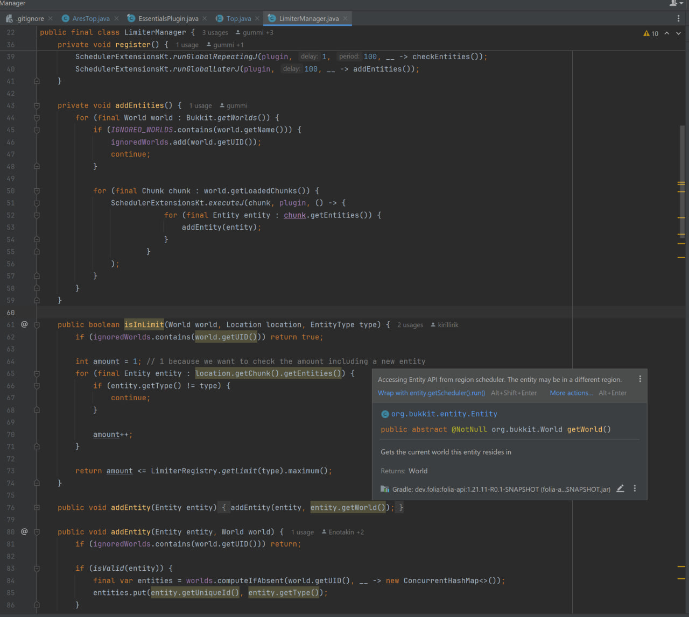

# Race Condition Detector

[]()
[]()
[]()

An IntelliJ IDEA plugin for static race condition detection in Java and Kotlin code. Analyzes field access patterns and thread contexts to identify potential concurrency issues before they occur.

## Features

### General Threading Issues

- **Race Condition Detection** — Detects fields accessed from multiple threads without synchronization
- **Check-Then-Act Patterns** — Identifies non-atomic check-then-act patterns on collections (e.g., `if (map.containsKey(k)) map.get(k)`)
- **Read-Modify-Write Operations** — Catches non-atomic operations like `count++`, `x += y` on shared fields
- **'this' Escape in Constructors** — Detects when `this` reference escapes during construction or when overridable methods are called
- **Unsafe Collections** — Flags thread-unsafe collections (HashMap, ArrayList, etc.) accessed from multiple threads
- **Mutable State Publication** — Warns when internal mutable collections are exposed via public methods
- **Spring Bean Shared State** — Detects mutable instance fields in singleton Spring beans (@Controller, @Service, etc.)

### Folia-Specific Checks

- **Cross-Context API Access** — Prevents accessing Bukkit/Spigot APIs from wrong thread contexts in Folia
- **Shared State in Folia Plugins** — Detects unsafe shared state in Folia event listeners and plugin classes
- **Deprecated BukkitScheduler** — Flags deprecated BukkitScheduler usage, suggests region-aware scheduler APIs

## Installation

### From JetBrains Marketplace (Coming Soon)

1. Open **Settings/Preferences** → **Plugins**
2. Search for "Race Condition Detector"
3. Click **Install**
4. Restart IntelliJ IDEA

### From GitHub Releases

1. Download the latest `.zip` from [Releases](https://github.com/yourusername/thread-checker/releases)
2. Open **Settings/Preferences** → **Plugins** → **⚙️** → **Install Plugin from Disk...**
3. Select the downloaded `.zip` file
4. Restart IntelliJ IDEA

### Building from Source

```bash
git clone https://github.com/yourusername/thread-checker.git
cd thread-checker
./gradlew buildPlugin
```

The plugin `.zip` will be in `build/distributions/`.

## Usage

Once installed, the plugin runs automatically. Open any Java or Kotlin file, and potential threading issues will be highlighted:



### Configuring Inspections

1. Open **Settings/Preferences** → **Editor** → **Inspections**
2. Navigate to **Threading Issues** or **Folia Threading Issues**
3. Enable/disable specific inspections and adjust severity levels

### Plugin Settings

**Settings/Preferences** → **Editor** → **Inspection Settings** → **Race Condition Detector**

- **Enable Spring Framework checks** — Enable/disable Spring-specific inspections
- **Enable Folia checks** — Enable/disable Folia-specific inspections (auto-detected by classpath)
- **False Positive Suppression** — Configure patterns to reduce false positives

## Quick Fixes

The plugin provides automatic quick-fixes for many issues:

- **Add `volatile` modifier** — For simple visibility issues
- **Replace with `AtomicInteger`/`AtomicLong`** — For counter fields
- **Wrap with `synchronized` block** — For synchronized access
- **Replace with `ConcurrentHashMap`** — For thread-safe maps
- **Replace with `computeIfAbsent()`** — For check-then-act patterns
- **Wrap with `Collections.unmodifiable*()`** — For exposed collections
- **Extract to factory method** — For 'this' escape issues

## Suppressing Warnings

Use standard `@SuppressWarnings` annotation:

```java
@SuppressWarnings("RaceCondition")
private int counter;
```

Or suppress for the entire class:

```java
@SuppressWarnings("ThreadingIssues")
public class MyClass {
    // ...
}
```

## Supported Thread Contexts

The plugin recognizes:

- **Java built-in**: `Thread.start()`, `ExecutorService.submit()`, `@Async`
- **Spring Framework**: `@Async`, `@Scheduled`, request handling threads
- **Bukkit/Spigot**: `BukkitScheduler` APIs
- **Folia**: `GlobalRegionScheduler`, `RegionScheduler`, `EntityScheduler`, `AsyncScheduler`

## Architecture

The plugin consists of five core modules:

1. **Field Access Analyzer** — Traverses PSI/UAST trees to collect field access locations and their thread contexts
2. **Thread Context Resolver** — Determines thread context (main thread, worker thread, Folia contexts, etc.)
3. **Synchronization Checker** — Checks for synchronization mechanisms (volatile, synchronized, Lock, AtomicXxx, @GuardedBy)
4. **Folia Context Analyzer** — Detects Folia projects, maps scheduler APIs and events to thread contexts
5. **Inspections & Quick-fixes** — IDE inspection implementations with automatic fixes

See [CLAUDE.md](CLAUDE.md) for technical details and architecture documentation.

## Contributing

Contributions are welcome! Please:

1. Fork the repository
2. Create a feature branch: `git checkout -b feature/my-new-feature`
3. Make your changes and add tests
4. Run tests: `./gradlew test`
5. Build the plugin: `./gradlew buildPlugin`
6. Commit your changes: `git commit -am 'Add new feature'`
7. Push to the branch: `git push origin feature/my-new-feature`
8. Submit a pull request

### Development Setup

Requirements:
- JDK 17+
- Gradle 8.5+
- IntelliJ IDEA 2024.3+ (for testing)

```bash
./gradlew runIde  # Launch plugin in development IDE
./gradlew test    # Run tests
./gradlew buildPlugin  # Build distributable plugin
```

See [docs/](docs/) for detailed development documentation.

## References

- [Java Concurrency in Practice](https://jcip.net/) by Brian Goetz
- [Java Memory Model Specification](https://docs.oracle.com/javase/specs/jls/se17/html/jls-17.html#jls-17.4)
- [Folia Documentation](https://docs.papermc.io/folia)
- [IntelliJ Platform SDK](https://plugins.jetbrains.com/docs/intellij/)

## License

Licensed under the Apache License, Version 2.0. See [LICENSE](LICENSE) for details.

## Acknowledgments

- Inspired by [FindBugs](http://findbugs.sourceforge.net/), [SpotBugs](https://spotbugs.github.io/), and [Error Prone](https://errorprone.info/)
- Built with the [IntelliJ Platform SDK](https://plugins.jetbrains.com/docs/intellij/)

---

**Feedback & Issues**: [GitHub Issues](https://github.com/yourusername/thread-checker/issues)

**Author**: [@yourusername](https://github.com/yourusername)
